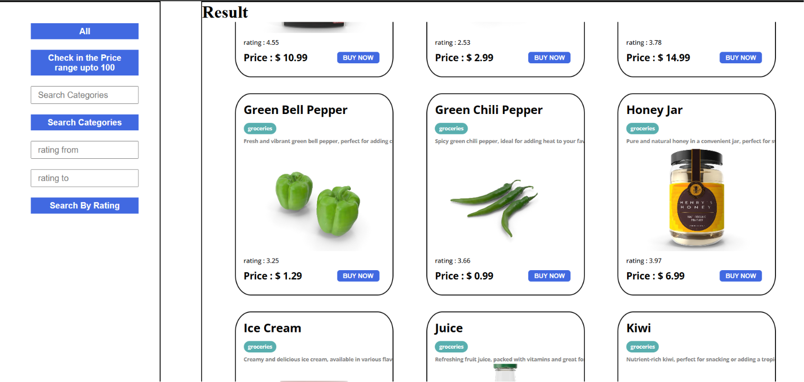

# Product Filter App

A dynamic E-commerce Product Filtering Application built using **HTML, CSS, and JavaScript**. The application fetches product data from the DummyJSON API and allows users to browse and filter products based on different criteria.

## 🚀 Features

* Display all products from the API
* Filter products with price up to $100
* Search products by category
* Filter products by rating range
* Dynamic product card generation
* Responsive card layout
* Product image, title, category, description, rating, and price display
* Clean and user-friendly interface

## 🛠️ Technologies Used

* HTML5
* CSS3
* JavaScript (ES6)
* Fetch API
* DummyJSON API

## 📸 Project Preview




## 📂 Project Structure

```text
product-filter-app/
│
├── index.html
├── style.css
├── script.js
└── README.md
```

## 🔗 API Used

DummyJSON Products API:

```text
https://dummyjson.com/products
```

## ⚙️ How to Run

1. Clone the repository

```bash
git clone https://github.com/your-username/product-filter-app.git
```

2. Open the project folder

```bash
cd product-filter-app
```

3. Open `index.html` in your browser

No additional installation is required.


## Live Demo

```bash
Live Website: https://product-filter-application.netlify.app/```

## 🎯 Learning Outcomes

Through this project, I practiced:

* API Integration using Fetch API
* DOM Manipulation
* Event Handling
* Dynamic UI Rendering
* Array Methods (map, filter)
* Responsive Layout Design
* JavaScript Project Structure

## 🔮 Future Improvements

* Add to Cart functionality
* Product Sorting (Low to High / High to Low)
* Search by Product Name
* Pagination
* Dark Mode
* Product Details Page

## 👨‍💻 Author

Adarshraj Shah

